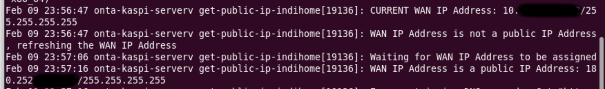
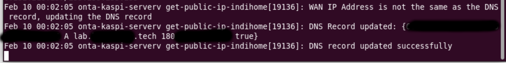

### !! DO YOUR OWN RISK !!
### _The Router for this code is ZTE F670L._

---
## GET IP PUBLIC ISP INDOHOME AUTOMACALLY
This Apps will run (every 10 minutes) selenium headless chrome and login to the router page for getting ip public of ISP Indihome, by changing the WAN ip auth type "PAP" or "Auto" until the ip is public. The application will update Cloudflare selected DNS A Record with the current WAN IP of the router automatically.

Please logout the router session when the application start the selenium headless chrome, because will be error when the application try to login to the router page.

---
### Must to install
- [Selenium] 
- [Chrome Driver]
- [Cloudflare API]
- [Golang]

ref: https://tecadmin.net/setup-selenium-chromedriver-on-ubuntu/

---

### For your use, change line
- Change the port to listen in line 57 to your port
```go
	http.ListenAndServe(":8080", nil)
```
- The Chrome Driver binnary in line 57 to your chrome driver binary path
```go
service, err := selenium.NewChromeDriverService("/usr/bin/chromedriver", 4444)
```
- The route login page in line 129 to your router login page
```go
	err = wd.Get("http://192.168.1.1")
```
- The username and password in line 148 and 152 to your router username and password
```go
        148 	err = username.SendKeys("admin")
	152 	err = password.SendKeys("xxxxxx")
```
- The Cloudflare DNS API_KEY and ZONE ID in line 339 and 340 to your Cloudflare DNS API_KEY and ZONE ID
```go
    339 	apiKey := "xxxxxxxxxxxxxxxxxxxxxxxxxxxxxxxxxxxxxxxx"
    340 	zoneID := "xxxxxxxxxxxxxxxxxxxxxxxxxxxxxxxx"
```
- The A Record Name in line 350 to your A Record Name
```go
    350 	if record.Name == "example.hostname.com" {
```
- Your Cloudflare Email in line 353 to your Cloudflare Email
```go
    req.Header.Set("X-Auth-Email", "youremail@gmail.com")
```

## Output


